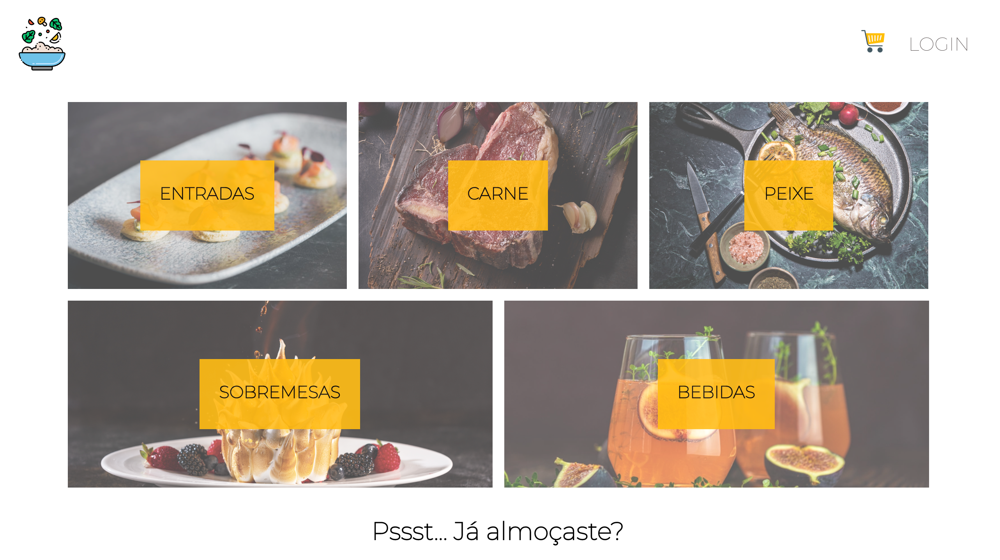

# EatTastyFood Frontend Application

A food delivery web application that consumes data from the [EatTastyFood API](https://github.com/soraiavmv/eat-tasty-food-api). 



# Technologies

This App was created using React.js (skeleton created using create-react-app).

## Installation

Use the package manager [npm](https://www.npmjs.com/) to install EatTastyFood.

```bash
# in the root folder
npm install
```

## Run

```bash
# in the root folder
npm start
```

**NOTE:** App will be accessible on *localhost:3000*

***WARNING:*** You need to have the API server running in order to correctly execute this app.

## Contributing
Pull requests are welcome. For major changes, please open an issue first to discuss what you would like to change.

## Disclaimer:
This is a dummy app; payment isn't connected to any backend implementation.